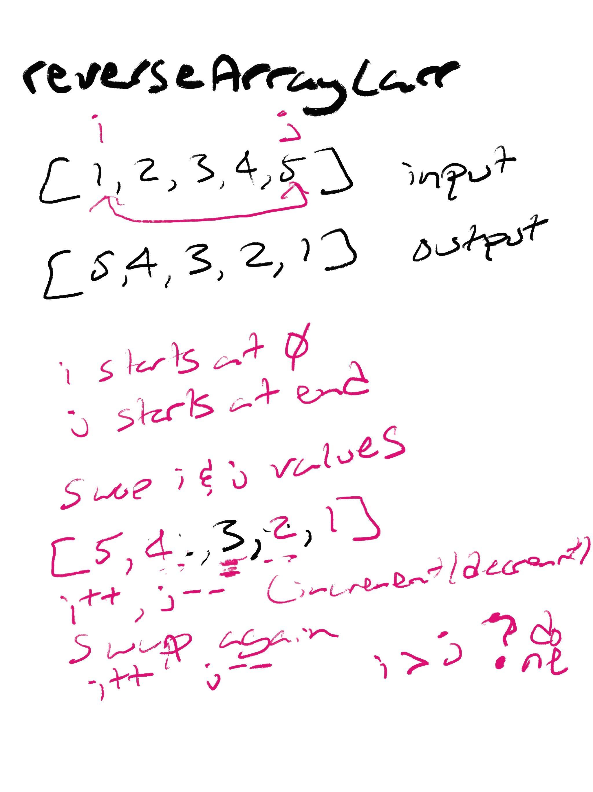

# Reverse an Array

## Challenge

Write a function called reverseArray which takes an array as an argument. Without utilizing any of the built-in methods available to your language, return an array with elements in reversed order.

## Approach & Efficiency

I used the built in reduce method to loop through the input array, I then unshift the current value into the accumulator and return it.

## Solution
