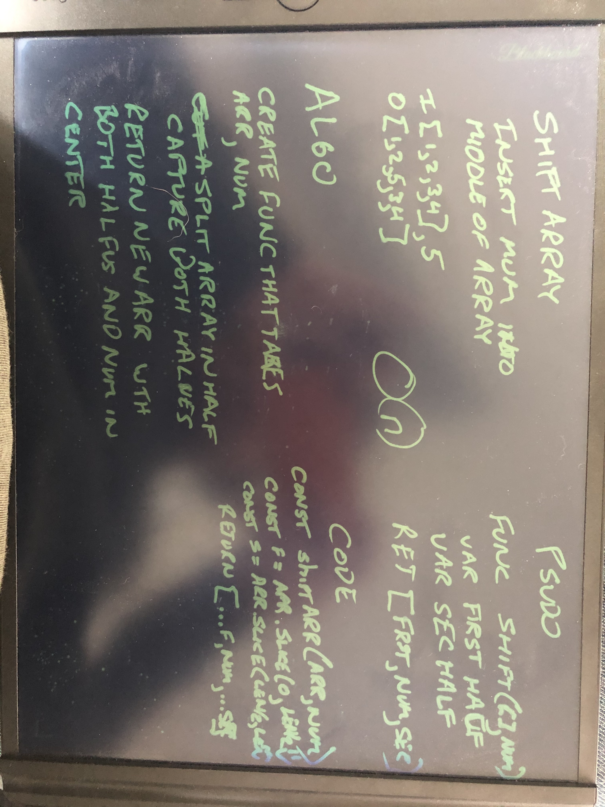

# Insert into Middle of Array

## Challenge

Write a function called insertShiftArray which takes in an array and the value to be added. Without utilizing any of the built-in methods available to your language, return an array with the new value added at the middle index.

## Approach & Efficiency
I used the slice to half the input array, then spread them with the input number into the return array.

### O(n)

## Solution

